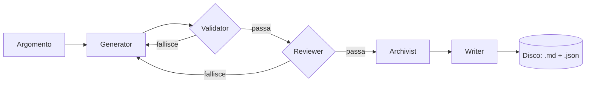

# Verified Notes Pipeline

[](https://github.com/francesco-cassese/verified-notes-pipeline/actions/workflows/ci.yml)

Una pipeline multi-agente che genera appunti tecnici di programmazione ancorati alla documentazione ufficiale — non alla memoria di un modello linguistico.

Chiedile un argomento ("PHP foreach", "React useEffect hook", "indici PostgreSQL") e lei cerca fonti ufficiali, scrive una bozza basata sul testo reale delle pagine trovate, e la fa passare attraverso controlli indipendenti prima di salvarla su disco. Se un controllo fallisce, il motivo torna indietro per un nuovo tentativo. Niente arriva su disco finché ogni affermazione contenuta non è riconducibile a una fonte realmente recuperata.

## Perché

Un LLM a cui si chiede di generare contenuto tecnico con un singolo prompt tende a produrre testo che suona autorevole anche quando è sbagliato — sintassi datate, pattern deprecati, API ricordate dal training che non riflettono più la documentazione attuale. Chiedere al modello di "stare attento" non risolve il problema.

Questo progetto rende l'allucinazione strutturalmente più difficile, invece: la correttezza nasce da controlli indipendenti dentro la pipeline, non da un singolo passaggio di generazione che si fida di se stesso.

## Come funziona



Cinque agenti specializzati, ognuno con un solo compito, coordinati da un orchestratore che ritenta solo i passaggi non deterministici:

| Agente | Tipo | Responsabilità |
|---|---|---|
| **Generator** | LLM | Traduce l'argomento in inglese prima di cercarlo (Brave privilegia risultati non ufficiali nella lingua della query, anche con un suffisso "official documentation"), poi cerca solo su domini di documentazione ufficiale, recupera il testo reale delle pagine trovate e scrive la bozza basandosi su quegli estratti — mai sulla conoscenza pregressa del modello. Riusa le fonti già trovate nei tentativi successivi della stessa generazione invece di ripetere la ricerca, quando il retry è dovuto a un rifiuto di Validator o Reviewer e non a un problema della ricerca stessa. |
| **Validator** | deterministico | Controlla la bozza contro uno schema rigido e verifica che ogni fonte citata sia esattamente uno degli URL restituiti dalla ricerca — non solo un dominio plausibile. Nessuna chiamata LLM, quindi è economico rieseguirlo a ogni tentativo. |
| **Reviewer** | LLM | In un'unica chiamata valuta tre aspetti indipendenti della bozza, ciascuno con un proprio verdetto: **perimetro/livello** (il contenuto resta in tema e non è più approfondito di quanto richieda un'introduzione, senza valutare la completezza — un dettaglio avanzato assente non è mai una lacuna), **aderenza alle fonti** (il filtro più severo: ogni fatto, esempio e frammento di codice trova riscontro negli estratti recuperati, scartando contenuto plausibile ma scritto a memoria — tranne i fatti definitori universalmente noti, es. "un tipo Integer memorizza numeri interi", che non richiedono citazione) e **best practice** (nessuna sintassi o pattern che le fonti stesse segnalano come superati, mai un'alternativa "più moderna" suggerita a memoria). Unire i tre controlli in una sola chiamata dimezza i token di contesto rispetto a chiamate separate, senza ridurre il rigore di nessun giudizio. |
| **Archivist** | deterministico | Mappa il modulo/tecnologia della nota su una cartella canonica tramite una tabella fissa, invece di usare alla lettera la dicitura dedotta dal modello — evita cartelle quasi-duplicate come `react/` vs `reactjs/`. |
| **Writer** | deterministico | Formatta la bozza approvata secondo un template Markdown fisso (frontmatter, indice, sezioni, tabella errori comuni, fonti, key takeaways, glossario opzionale) e la scrive su disco insieme a un sidecar JSON con gli stessi dati strutturati. |

L'**orchestratore** tiene insieme tutto: se un controllo fallisce, il motivo specifico torna in un nuovo tentativo di generazione (massimo 3), invece di far ripartire l'intera pipeline alla cieca. Non tutto è però retryabile: se non esiste alcuna fonte ufficiale per l'argomento, o se il salvataggio finale su disco fallisce, la pipeline si ferma subito invece di continuare a consumare chiamate al modello su un problema che ritentare non risolverebbe.

Nel caso migliore una generazione richiede quindi 1 ricerca web + 2 chiamate LLM (Generator, Reviewer); nel caso peggiore (3 tentativi, sempre respinta) al massimo 1 ricerca + 6 chiamate LLM: la ricerca gira una sola volta per argomento e Reviewer sostituisce due chiamate separate con una.

Prima ancora di avviare la pipeline, il controller confronta l'argomento richiesto con quelli già salvati in archivio (case-insensitive): se un appunto per lo stesso argomento esiste già, restituisce subito un evento `duplicate` con il riferimento all'appunto esistente, a costo zero (nessuna ricerca, nessuna chiamata LLM).

L'avanzamento viene trasmesso al frontend via Server-Sent Events man mano che ogni fase viene eseguita, dato che una generazione completa può richiedere diverse chiamate LLM in sequenza. Lo stato della generazione in corso vive in un context React sollevato sopra le route (`GenerationContext`), così cambiare pagina durante una generazione non la interrompe né la fa perdere; un `ErrorBoundary` con azione "Riprova" avvolge le route e si resetta automaticamente a ogni cambio di percorso.

## Sicurezza

- **Protezione da path traversal** — titoli e nomi di modulo vengono trasformati in slug tramite una whitelist rigida (solo `[a-z0-9-]`), e ogni percorso file risolto viene verificato per contenimento dentro la directory degli appunti prima di ogni lettura o scrittura.
- **Protezione SSRF senza finestra DNS-rebinding** — le pagine delle fonti recuperate sono limitate a una whitelist curata di domini ufficiali e ricontrollate dopo eventuali redirect. La validazione "l'IP non è privato" avviene nello stesso identico lookup DNS usato per aprire davvero la connessione (un `Agent` undici con `connect.lookup` custom), non in un controllo separato fatto prima: così un dominio con TTL bassissimo non può rispondere un IP pubblico al controllo e uno privato alla richiesta reale.
- **Validazione di appartenenza delle fonti** — superare la whitelist di dominio non basta: il Validator verifica anche che l'URL citato sia esattamente uno di quelli restituiti dalla ricerca per quel tentativo, così un URL plausibile ma inventato su un dominio comunque ufficiale viene comunque respinto.
- **Rate limiting sulla generazione** — `POST /api/notes` è l'unico endpoint che costa (fino a `maxAttempts` chiamate LLM + ricerca in sequenza): è limitato per IP (default 5 richieste ogni 15 minuti, configurabile) per evitare che chiunque lo raggiunga possa consumare la quota Anthropic/Brave a piacere. Gli endpoint di lettura dell'archivio non hanno limiti, sono solo accessi al filesystem.

## Stack tecnologico

**Backend** — Node.js, Express 5, [LangChain](https://js.langchain.com) + [Claude](https://www.anthropic.com/claude), Zod, Brave Search API, Cheerio
**Frontend** — React 19, React Router, react-markdown, Vite

## Struttura del progetto

```
apps/
  backend/
    src/
      ai/
        agents/        # i cinque agenti
        orchestrator/   # retry loop + composizione delle dipendenze
        schemas/        # schemi Zod per un appunto generato
        tools/           # tool di ricerca Brave
        models/          # client Claude
      controllers/       # handler SSE + REST
      routes/
      utils/             # settings, logging, path sicuri, whitelist domini ufficiali, mapping moduli
    test/                # rispecchia src/, test runner nativo di Node
  frontend/
    src/
      pages/             # pagina di generazione + archivio
      components/        # include ErrorBoundary con retry, resettato per route
      context/            # GenerationContext: stato di generazione condiviso tra le route
      hooks/
      utils/
```

## Come avviarlo

Richiede Node.js e [pnpm](https://pnpm.io).

```bash
pnpm install

# apps/backend/.env — copia da .env.example e compila:
#   CLAUDE_API_KEY   chiave API Anthropic
#   BRAVE_API_KEY    chiave API Brave Search
# Il resto (timeout, tentativi, rate limit) è opzionale, con default sensati in utils/settings.js

pnpm dev:backend   # API Express su :3000
pnpm dev:frontend  # dev server Vite, proxy di /api verso :3000
```

In produzione, `pnpm build` compila il frontend dentro `apps/backend/public`, e `pnpm start` avvia l'unico server Express che serve sia l'API che la SPA compilata.

## API

| Metodo | Percorso | Descrizione |
|---|---|---|
| `POST` | `/api/notes` | Genera un appunto per un argomento; trasmette l'avanzamento della pipeline come Server-Sent Events, terminando con un evento `result` (`success`, `error`, o `duplicate` se l'argomento è già in archivio — in quel caso la pipeline non viene nemmeno avviata). |
| `GET` | `/api/notes/folders` | Elenca le cartelle modulo/tecnologia con il conteggio degli appunti. |
| `GET` | `/api/notes/folders/:folder` | Elenca gli appunti in una cartella. |
| `GET` | `/api/notes/folders/:folder/:fileName` | Legge un singolo appunto. |

## Test

```bash
pnpm --filter backend test
```

Ogni agente e l'orchestratore sono costruiti come factory function che ricevono le proprie dipendenze come parametri (il client del modello, il tool di ricerca, un logger), così i test possono iniettare dei mock senza toccare la rete o le vere API di Anthropic/Brave.

Una GitHub Actions workflow ([`.github/workflows/ci.yml`](.github/workflows/ci.yml)) esegue test, lint e build a ogni push e pull request su `main`.

## Nota sullo sviluppo

Ho progettato l'architettura di questa pipeline — quanti agenti servono, cosa deve girare in sequenza, cosa deve essere deterministico e cosa no — e l'ho implementata con l'aiuto di Claude (Anthropic) come assistente di codice. È stato anche un modo per esplorare i limiti del vibecoding: fin dove si può spingere lo sviluppo affiancato da un'AI quando le decisioni di design restano in mano a chi guida il progetto.
