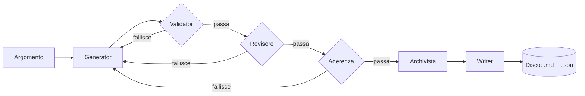

# Verified Notes Pipeline

Una pipeline multi-agente che genera appunti tecnici di programmazione ancorati alla documentazione ufficiale — non alla memoria di un modello linguistico.

Chiedile un argomento ("React useEffect hook", "PHP traits", "indici PostgreSQL") e lei cerca fonti ufficiali, scrive una bozza basata sul testo reale delle pagine trovate, e la fa passare attraverso quattro controlli indipendenti prima di salvarla su disco. Se un controllo fallisce, il motivo torna indietro per un nuovo tentativo. Niente arriva su disco finché ogni affermazione contenuta non è riconducibile a una fonte realmente recuperata.

## Perché

Un LLM a cui si chiede di generare contenuto tecnico con un singolo prompt tende a produrre testo che suona autorevole anche quando è sbagliato — sintassi datate, pattern deprecati, API ricordate dal training che non riflettono più la documentazione attuale. Chiedere al modello di "stare attento" non risolve il problema.

Questo progetto rende l'allucinazione strutturalmente più difficile, invece: la correttezza nasce da controlli indipendenti dentro la pipeline, non da un singolo passaggio di generazione che si fida di se stesso.

## Come funziona



Sei agenti specializzati, ognuno con un solo compito, coordinati da un orchestratore che ritenta solo i passaggi non deterministici:

| Agente | Tipo | Responsabilità |
|---|---|---|
| **Generator** | LLM | Cerca l'argomento solo su domini di documentazione ufficiale, recupera il testo reale delle pagine trovate e scrive la bozza basandosi su quegli estratti — mai sulla conoscenza pregressa del modello. |
| **Validator** | deterministico | Controlla la bozza contro uno schema rigido e verifica che ogni fonte citata sia esattamente uno degli URL restituiti dalla ricerca — non solo un dominio plausibile. Nessuna chiamata LLM, quindi è economico rieseguirlo a ogni tentativo. |
| **Revisore** | LLM | Verifica che il contenuto resti in tema e al livello di approfondimento corretto per l'argomento richiesto, senza divagazioni su materiale avanzato non richiesto. |
| **Aderenza** | LLM | Il filtro più severo: confronta ogni fatto, esempio e frammento di codice della bozza con gli estratti delle fonti recuperate, scartando contenuto plausibile ma scritto a memoria. |
| **Archivista** | deterministico | Mappa il modulo/tecnologia della nota su una cartella canonica tramite una tabella fissa, invece di usare alla lettera la dicitura dedotta dal modello — evita cartelle quasi-duplicate come `react/` vs `reactjs/`. |
| **Writer** | deterministico | Formatta la bozza approvata secondo un template Markdown fisso (frontmatter, indice, sezioni, tabella errori comuni, fonti, key takeaways, glossario opzionale) e la scrive su disco insieme a un sidecar JSON con gli stessi dati strutturati. |

L'**orchestratore** tiene insieme tutto: se un controllo fallisce, il motivo specifico torna in un nuovo tentativo di generazione (massimo 3), invece di far ripartire l'intera pipeline alla cieca. Non tutto è però retryabile: se non esiste alcuna fonte ufficiale per l'argomento, o se il salvataggio finale su disco fallisce, la pipeline si ferma subito invece di continuare a consumare chiamate al modello su un problema che ritentare non risolverebbe.

L'avanzamento viene trasmesso al frontend via Server-Sent Events man mano che ogni fase viene eseguita, dato che una generazione completa può richiedere diverse chiamate LLM in sequenza.

## Sicurezza

- **Protezione da path traversal** — titoli e nomi di modulo vengono trasformati in slug tramite una whitelist rigida (solo `[a-z0-9-]`), e ogni percorso file risolto viene verificato per contenimento dentro la directory degli appunti prima di ogni lettura o scrittura.
- **Protezione SSRF** — le pagine delle fonti recuperate sono limitate a una whitelist curata di domini di documentazione ufficiale, verificate contro una allowlist di IP pubblici tramite lookup DNS (bloccando range privati/loopback/link-local), e ricontrollate dopo eventuali redirect.
- **Validazione di appartenenza delle fonti** — superare la whitelist di dominio non basta: il Validator verifica anche che l'URL citato sia esattamente uno di quelli restituiti dalla ricerca per quel tentativo, così un URL plausibile ma inventato su un dominio comunque ufficiale viene comunque respinto.

## Stack tecnologico

**Backend** — Node.js, Express 5, [LangChain](https://js.langchain.com) + [Claude](https://www.anthropic.com/claude), Zod, Brave Search API, Cheerio
**Frontend** — React 19, React Router, react-markdown, Vite

## Struttura del progetto

```
apps/
  backend/
    src/
      ai/
        agents/        # i sei agenti
        orchestrator/   # retry loop + composizione delle dipendenze
        schemas/        # schemi Zod per un appunto generato
        tools/           # tool di ricerca Brave
        models/          # client Claude
      controllers/       # handler SSE + REST
      routes/
      utils/             # settings, logging, path sicuri, whitelist domini ufficiali, mapping moduli
    test/                # rispecchia src/, test runner nativo di Node
  frontend/
    src/
      pages/             # pagina di generazione + archivio
      components/
      hooks/
```

## Come avviarlo

Richiede Node.js e [pnpm](https://pnpm.io).

```bash
pnpm install

# apps/backend/.env — copia da .env.example e compila:
#   CLAUDE_API_KEY   chiave API Anthropic
#   BRAVE_API_KEY    chiave API Brave Search

pnpm dev:backend   # API Express su :3000
pnpm dev:frontend  # dev server Vite, proxy di /api verso :3000
```

In produzione, `pnpm build` compila il frontend dentro `apps/backend/public`, e `pnpm start` avvia l'unico server Express che serve sia l'API che la SPA compilata.

## API

| Metodo | Percorso | Descrizione |
|---|---|---|
| `POST` | `/api/appunti` | Genera un appunto per un argomento; trasmette l'avanzamento della pipeline come Server-Sent Events, terminando con un evento `risultato` (successo o errore). |
| `GET` | `/api/appunti/cartelle` | Elenca le cartelle modulo/tecnologia con il conteggio degli appunti. |
| `GET` | `/api/appunti/cartelle/:cartella` | Elenca gli appunti in una cartella. |
| `GET` | `/api/appunti/cartelle/:cartella/:nomeFile` | Legge un singolo appunto. |

## Test

```bash
pnpm --filter backend test
```

Ogni agente e l'orchestratore sono costruiti come factory function che ricevono le proprie dipendenze come parametri (il client del modello, il tool di ricerca, un logger), così i test possono iniettare dei mock senza toccare la rete o le vere API di Anthropic/Brave.

## Nota sullo sviluppo

Ho progettato l'architettura di questa pipeline — quanti agenti servono, cosa deve girare in sequenza, cosa deve essere deterministico e cosa no — e l'ho implementata con l'aiuto di Claude (Anthropic) come assistente di codice. È stato anche un modo per esplorare i limiti del vibecoding: fin dove si può spingere lo sviluppo affiancato da un'AI quando le decisioni di design restano in mano a chi guida il progetto.
